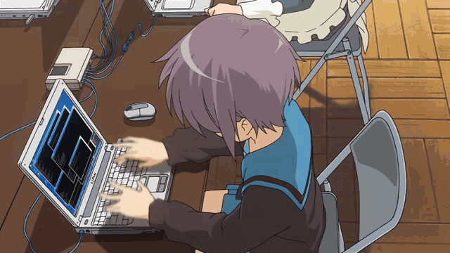

# 💻 **`Hi, I'm Shiro`**   
*(Or as my DNS server calls me: `realaoishiro`)*  

---

## 🎭 **`Who the Chimichanga Am I?`**  
<table>
  <tr>
    <td width="50%">  
        
    </td>
    <td width="50%">  
      - 🔠Obsession: Breaking code (and occasionally the 4th wall)    
      - 🖥️ Day Job: Cyber Mercenary  
      - 🤖 Night Job: Teaching AIs to meme. <!--Spoiler: They’re terrible.-->  
      - 💥 Life Motto: while True: act() | eat_chimichanga()
    </td>
  </tr>
</table>

---

## 🛠️ **`Weapons (a.k.a. Tech Stack)`**  
| **`Code Slinging`** | **`Cyber Shenanigans`** | **`Distractions`** |  
|----------------------|-------------------------|--------------------|  
|  |  | |  
| `C`/`C++`/`Python`/`Java`/`Bash`/`Javascript`| `Wireshark`/`Metasploit`/`BurpSuite`/`Nmap` | `      Overengineering Side Projects      ` |  

---

## 🚨 **`Active Exploits (a.k.a. Projects)`**  

  
  
 <b> 📟 Click Me (I Dare You) </b> 
  
  
Nothing here yet! TuT

  

---

  
  "You’re still here? Go fork a repo or something." 

<!-- Hidden message for nerds -->  
<!-- 🚫⚠️ *`rm -rf / --no-preserve-root` was my idea.* ⚠️🚫 -->
